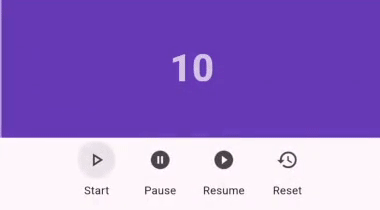

# Progress Bar Countdown

Create an animated linear progress bar countdown timer using Progress Bar Countdown.

## Features

* Forward and reverse countdown timer
* Start, pause, resume, and reset timer functionality
* Customizable colors and styles
* Option to show/hide countdown text
* Left-to-right or right-to-left progress direction



## Getting Started

To use this plugin, add `progress_bar_countdown` as a [dependency in your pubspec.yaml file](https://flutter.dev/docs/development/packages-and-plugins/using-packages).

```yaml
dependencies:
  progress_bar_countdown: ^0.0.1
```

## Usage

```dart
ProgressBarCountdown(
  initialDuration: 60,
  progressColor: Colors.blue,
  progressBackgroundColor: Colors.grey[300]!,
  initialTextColor: Colors.black,
  revealedTextColor: Colors.white,
  height: 40,
  textStyle: TextStyle(fontSize: 20, fontWeight: FontWeight.bold),
  countdownDirection: ProgressBarCountdownAlignment.left,
  controller: ProgressBarCountdownController(),
  autoStart: true,
  onComplete: () {
    print('Countdown Completed');
  },
  onStart: () {
    print('Countdown Started');
  },
  onChange: (String timeStamp) {
    print('Countdown Changed $timeStamp');
  },
)
```

## Parameters

| Name | Type | Default Value | Description |
|:-----|:-----|:--------------|:------------|
| `initialDuration` | `double` | required | Countdown duration in seconds. |
| `progressColor` | `Color` | required | Color of the progress bar. |
| `progressBackgroundColor` | `Color` | `Colors.white` | Background color of the progress bar. |
| `initialTextColor` | `Color?` | null | Initial color of the countdown text. |
| `revealedTextColor` | `Color?` | null | Color of the countdown text as it's revealed by the progress bar. |
| `hideText` | `bool` | false | Whether to hide the countdown text. |
| `height` | `double` | 50.0 | Height of the progress bar. |
| `textStyle` | `TextStyle` | `TextStyle(fontSize: 18, fontWeight: FontWeight.bold)` | Style of the countdown text. |
| `countdownDirection` | `ProgressBarCountdownAlignment` | `ProgressBarCountdownAlignment.left` | Direction of the countdown (left-to-right or right-to-left). |
| `controller` | `ProgressBarCountdownController?` | null | Controller for the countdown timer. |
| `autoStart` | `bool` | false | Whether to start the countdown automatically. |
| `onComplete` | `VoidCallback?` | null | Callback executed when the countdown completes. |
| `onStart` | `VoidCallback?` | null | Callback executed when the countdown starts. |
| `onChange` | `ValueChanged<String>?` | null | Callback executed when the countdown value changes. |

## ProgressBarCountdownController

The `ProgressBarCountdownController` allows you to control the countdown timer programmatically.

### Methods

- `start()`: Starts the countdown timer.
- `pause()`: Pauses the countdown timer.
- `resume()`: Resumes the paused countdown timer.
- `reset({double? duration})`: Resets the countdown timer. Optionally specify a new duration.
- `getTime()`: Returns the current time of the countdown timer as a string.

### Usage Example

```dart
final controller = ProgressBarCountdownController();

// In your build method
ProgressBarCountdown(
  // ... other parameters ...
  controller: controller,
)

// Later in your code
ElevatedButton(
  onPressed: () => controller.start(),
  child: Text('Start'),
)

ElevatedButton(
  onPressed: () => controller.pause(),
  child: Text('Pause'),
)

ElevatedButton(
  onPressed: () => controller.resume(),
  child: Text('Resume'),
)

ElevatedButton(
  onPressed: () => controller.reset(duration: 30),
  child: Text('Reset to 30 seconds'),
)
```

## Example

Here's a complete example demonstrating how to use the ProgressBarCountdown widget:

```dart
import 'package:flutter/material.dart';
import 'package:progress_bar_countdown/progress_bar_countdown.dart';

void main() {
  runApp(MyApp());
}

class MyApp extends StatelessWidget {
  @override
  Widget build(BuildContext context) {
    return MaterialApp(
      home: Scaffold(
        appBar: AppBar(title: Text('Progress Bar Countdown Example')),
        body: Center(
          child: ProgressBarCountdown(
            initialDuration: 60,
            progressColor: Colors.blue,
            progressBackgroundColor: Colors.grey[300]!,
            initialTextColor: Colors.black,
            revealedTextColor: Colors.white,
            height: 40,
            textStyle: TextStyle(fontSize: 20, fontWeight: FontWeight.bold),
            countdownDirection: ProgressBarCountdownAlignment.left,
            controller: ProgressBarCountdownController(),
            autoStart: true,
            onComplete: () {
              print('Countdown Completed');
            },
            onStart: () {
              print('Countdown Started');
            },
            onChange: (String timeStamp) {
              print('Countdown Changed $timeStamp');
            },
          ),
        ),
      ),
    );
  }
}
```

This example creates a simple app with a progress bar countdown that starts automatically and runs for 60 seconds.